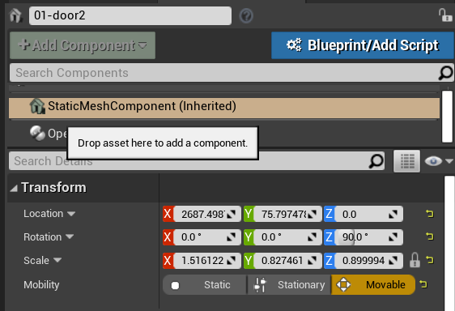

# How to rotate something programmatically?

## First steps to follow
* select what is the component that you will be rotating
* go to **details** panel and click to **+ Add Component**, and choose the **c++** Option
* In my local case I am using a door as reference, so I selected the door and added the component called **OpenDoor**
> Note: We will be rotating a door, as the motion of opening it, it is a basic Z rotation

### Important Notice!
If you implement this code and nothing happens, don't worry, you will need to check the error messages, when I was debuging this I could see that:
```shell
PIE: Warning: Mobility of /Game/Levels/UEDPIE_0_BuildingScape.BuildingScape:PersistentLevel.01-door2_9 :
StaticMeshComponent0 has to be Movable if youd like to move.
```
As you can notice, the element needs to be mobile
* Go to **Details** Section
* Check the **Transofrm Tab**
* Check for the **Mobility Section**
* Select the **Mobable** to make your object able to move


#### Mobile element?
* Select the element that you need to check if it is a mobile or not
* Go to the **Transform** Tab and check the last element **Mobility**

## Building the object
All the actions you will need to do in the cpp file, in our case the name was **OpenDoor.cpp**
* Import the Actor Class:
```cpp
#include "GameFramework/Actor.h"
```
*
