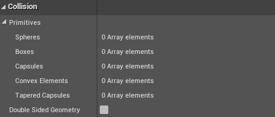
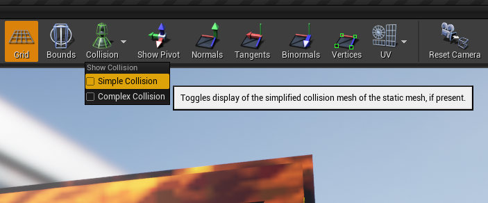

# How to remove colision from an object

# Steps to follow
* Go to the **Content Brownser**
* Open this object that you want to remove the colision
* Go to menu **Colision** and chosse **Remove Colision**
* After you remove the colision you will be able to check that is empty on:
  - Details tab
  - You must Scrow down til you find the tab **Colision**
  - You must check that are empty all values 

## How to check where is the colision point?
* You must search for the  COlision button int the main icons
* You must click to show all avaiable colisions
* After it expands you must remove the selected Colision

