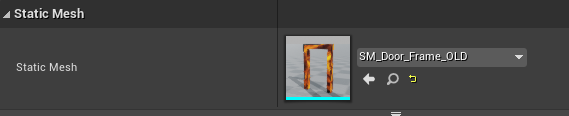
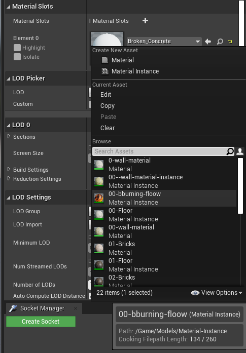
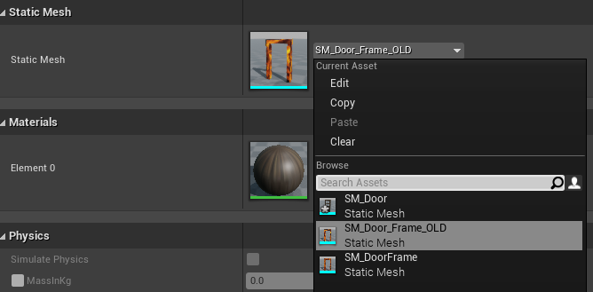

# 11-how to change update a statis mesh element

## Main objective
* Imagine yourself having to change a **door frame** that you didn't like at all
* As you can see if we have **lots of door frames** isn't recomended to delete
the previous door frame, create a new one and only after that fix the position
in the scene
* You must follow an idea of:
  - Create a new door frame
  - Find a place to remove the instance of the element and substitute by our new one
  - After that you can go to the door's group or individually change the reference of it

## Case: Changing a door frame

### First steps to check
* Lets say that you want to change but you dont want to remove before change everything
* So you will need to **rename** your previous **door frame** let's just add "_old"
  - Go to **Content Browser**, navigate to the **Models folder**
  - Find the Static Mesh that you want to change
* Create/Import(Button in Content Browser) a **new Static Mesh** for the **door frame**

### Changing the new Static Mesh to have the same material from the previous one
* You must double click to the new **Static Mesh** to edit
* Check on the right side you will find a tab **Material Slots** 
* Over there you will see a **select box**, if you expant it, you will check
all the options that you can apply over that Static Mesh, you can save after that

### Replacing the _old instance to the new one that we generated before
* Now you must swap the door frame, so you must select the _old door frame in the **World Outliner**

