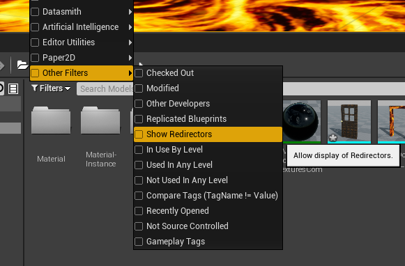
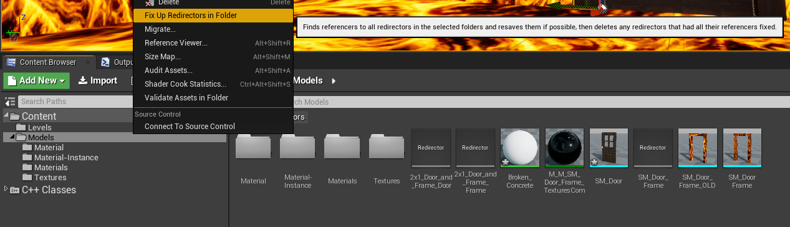
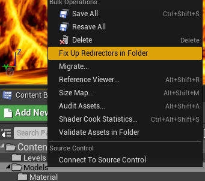
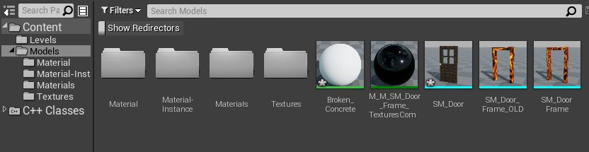

# 12-how to clean the redirectors

## Showing the redirectors
* Go to **Content Browser**
* On the highest level of the **Models folder**, Seect the **Filters**
* Hove **Other Filters** and select **Show redirectors**

* You will be able to see a few redirectors 
* now you must **right mouse click** on the **Models folder** and select the option: **Fix Up Redirectors In Folder**
* 
* The final result will be:

