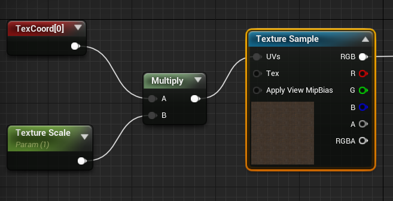
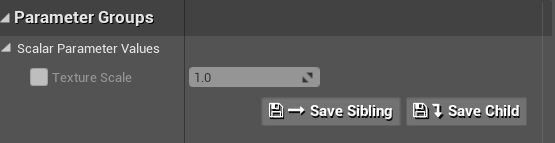
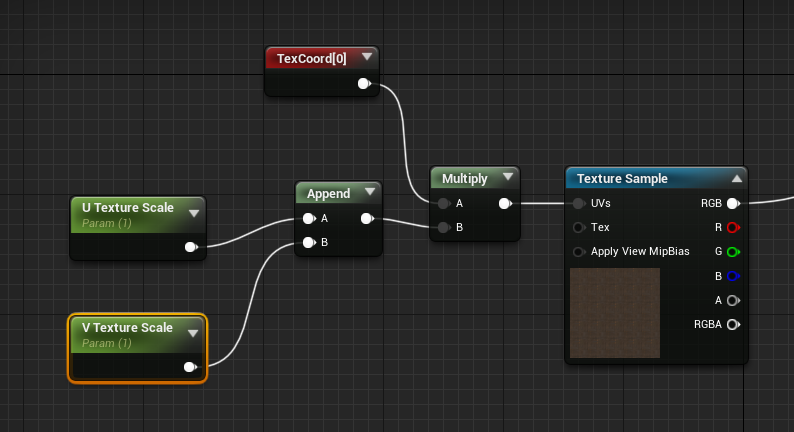
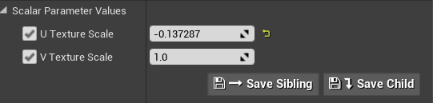

# How to Adjust the scale of a material

## Get into Edit Material
* Open the **Content Browser**
* Go to your **Material** Folder
* Select the **material** that you want to create a new property
* Double Click on it, to open the new tab to edit in a blueprint way


## Adding a Text Coordinate
We have a **Texture Sample** and the Instance of the **StoneMat**
* Search for **TextureCoordinate**
* You will need to attach it to: Texture Sample -> UV's
* You will be able to see the property **Utilling** and **VTilling**
Note: If you change those attributes will be changing on the frontend, but takes longer because it is necessary compilation


## Adding a ScaleParamether
This will allow us to extend a parameter from the Text Coordinate, so later on
we can be using it to check the changes on the rendering, so much faster!
* Search for **Scalar**
* pick the **Scalar Parameter** and add it


## Now it is necessary to multiply it!
* Search for **multiply**
* Select it!

### How to un-connect the socket?
* Hold **alt key** and press with your **left mouse button**


## Now it is the connection time
* **Text Coordinate** will be connected to **A** on Multiply
* **Texture Scale** will be connected to **B** on Multiply
* **Multiply** will be connected to the **UV'S** on **Texture Sample**


## Check of the Texture ScaleParamether

Note: You will notice that you can change the X and Y coordinates, but things aren't square if we need, so how to do that?


## Separating X and Y coordinates
* You will need to add a new **Texture Scale**, you can easily ```Ctrl+C``` and ```Ctrl+V```
* Now you have rename them to have clear names (so you can identify who is U or V Texture scale object)
* Now you will need to attach an **Append node**, with this one we can have **U Texture Scale** and **V Texture Scale** as a parameter
* Right click and search for **AppendVector**
* You will attach the **U and V Texture scales** on each **A and B** socket on the **AppendVector**, and the **AppendVector** will connect to **Multiply B node**



## Results in the Material Instance
Now you can go to the **material Instance** and check that we have 2 new parameters! U and V.

Note: if you change this parameter and check the results in the main editor, you will be able to see that its showing the preview in a live environment, so much faster than before!
